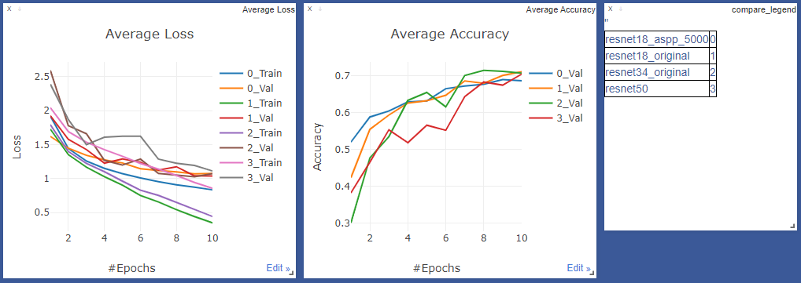

# DocClassifier
Document classification with 16 classes. Trained using PyTorch and Ignite.

I used 4000 images to train and 800 to validate for 10 epochs. To use less data I have fine tuned pretrained models.

Images are resized to 256x512 to keep a close aspect ratio to the original.
The models were trained using Adam for 10 epochs (I probably need to train for more) 

The models were trained with a batch size of 32.

Adjusted the learning rate every epoch using a polynomial learning rate scheduler, like DeepLab-v3 and ErfNet.

# Augmentations 
- Color jittering
- Random horizontal flip
- Random rotation [-15, +15] degrees
- Random translation to 0.1 * image size
- random zooning [0.75, 1.25]

# Results
| Model  | Validation Accuracy | Test Accuracy | Batch Size
| --- | --- | --- | --- |
| ResNet18      | 71.12 | TODO | 32
| Resnet34      | 71.50 | TODO | 32
| ResNet50      | 70.50 | TODO | 16
| ResNet18-ASPP*| 69.00 | TODO | 32

*ResNet50-ASPP had a 5000 image train set and a 5000 image validation set.
ResNet50 does not show signs of overfitting.

ResNet-ASPP adds an ASPP layer after the third block

I also tried training ResNet152, but I only have enough VRAM for batch size 6 and both training and validation losses 
are worse than other models.
