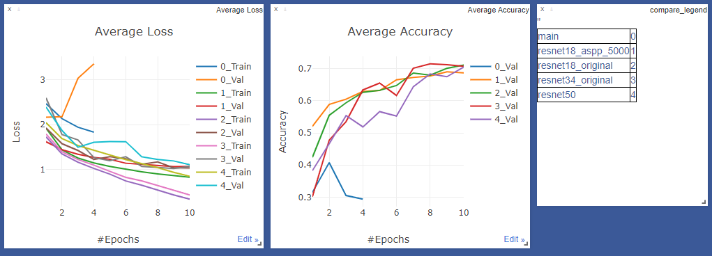

# DocClassifier
Document classification with 16 classes. Trained using PyTorch and Ignite.

I used 4000 images to train and 800 to validate for 10 epochs. To use less data I have fine tuned pretrained models.

Images are resized to 256x512 to keep a close aspect ratio to the original.
The models were trained using Adam for 10 epochs.

The models were trained with a batch size of 32.

Adjusted the learning rate every epoch using a polynomial learning rate scheduler, like DeepLab-v3 and ErfNet.

# Augmentations 
- Color jittering
- Random horizontal flip
- Random rotation [-15, +15] degrees
- Random translation to 0.1 * image size
- random zooning [0.75, 1.25]

# Results
| Model  | Validation Accuracy | Test Accuracy | Batch Size
| --- | --- | --- | --- |
| ResNet18      | 71.12 | TODO | 32
| Resnet34      | 71.50 | TODO | 32
| ResNet50      | 70.50 | TODO | 16
| ResNet18-ASPP*| 69.00 | TODO | 32

*ResNet50-ASPP had different training and validation set sizes but I do not remember exactly how many 
(I think it was 2000 training and 2000 validation or 5000 training and 5000 validation).

Below are some plots with the training and validation losses as well as the validation accuracy of the models. 
The model marked as main (0_Train, 0_Val) is ResNet-152. I stopped after 4 epochs due to overfitting (validation loss diverges).  

I also tried training ResNet152, but I only have enough VRAM for batch size 6 and both training and validation losses 
are worse than other models.
